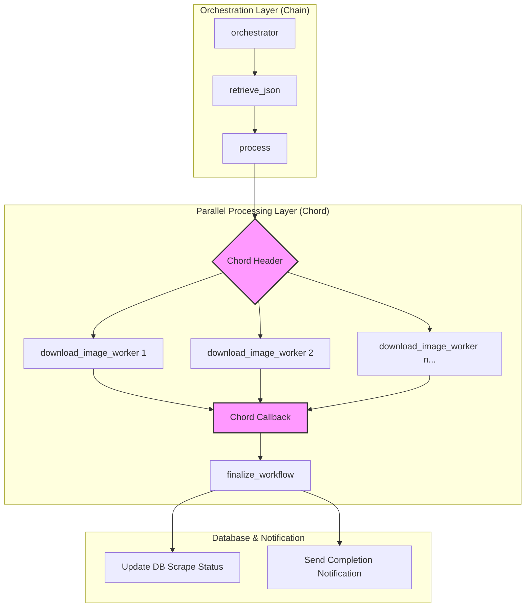

# Task Architecture

The Celery workflow in `campushub/core/services/tasks.py` uses a structured arrangement of **Chains** and **Chords** to manage parallel image processing and sequential data fetching.

## Celery Workflow Diagram

## Logic Explanation

### 1. The Chain (Orchestrator)
The workflow starts with a `chain` that ensures the data is first retrieved from the external source (`retrieve_json`) before being passed to the `process` task. This ensures the input for processing is available.

### 2. The Chord (Image Processing)
Within the `process` task, the system identifies all image URLs that need to be downloaded. 
*   **Header (Parallel Group)**: A list of `download_image_worker` signatures is created. Celery executes these in parallel across available workers to maximize performance.
*   **Callback (Synchronization)**: The `chord` ensures that `finalize_workflow` is triggered **only after every single image download task has completed**. It receives the results from all workers as a list.

### 3. Finalization
The `finalize_workflow` task acts as a cleanup and reporting phase, ensuring the database records are consistent and the user is notified of the results.
