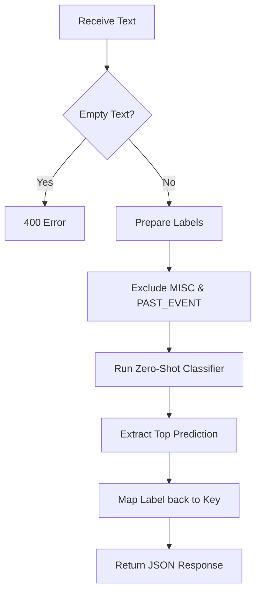

# CampusHub ML Backend

This service provides AI-driven text classification for CampusHub posts using a zero-shot classification model.

## Classification Logic

The `/classify` endpoint handles text classification following the workflow below:

### Key Features
- **Zero-Shot Classification**: Uses `cross-encoder/nli-deberta-v3-small` to categorize text without specific retraining.
- **Authoritative Categories**: The backend defines the source of truth for all categories used across the CampusHub ecosystem.
- **Smart Exclusion**: Forces the AI to pick a meaningful category by excluding generic types during the classification phase.
